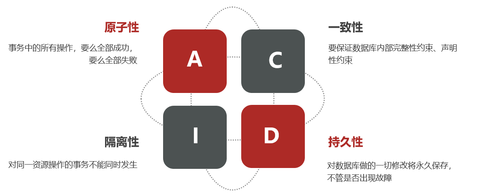
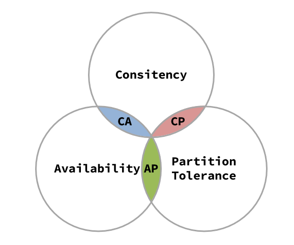

# Seate 分布式事务

## 1.简介

**本地事务**，也就是传统的**单机事务**。在传统数据库事务中，必须要满足四个原则：



**分布式事务**，就是指不是在单个服务或单个数据库架构下，产生的事务，例如：

- 跨数据源的分布式事务
- 跨服务的分布式事务
- 综合情况

比如一个服务里同时依赖3个服务 都具有修改数据库的功能那么这三个功能都是分事务 此时ACID无法满足，就需要分布式事务


## 2.CAP定理

*下列三个定理无法同时满足，这个理论就叫CAP定理*

- Consistency（一致性）
- Availability（可用性）
- Partition tolerance （分区容错性）




### 2.1.一致性C

​	Consistency（一致性）：用户访问分布式系统中的任意节点，得到的数据必须一致。


### 2.2.可用性A

 	Availability （可用性）：用户访问集群中的任意健康节点，必须能得到响应，而不是超时或拒绝。

### 2.3.分区容错P

​	 Partition（分区）：因为网络故障或其它原因导致分布式系统中的部分节点与其它节点失去连接，形成独立分区。

​	Tolerance（容错）：在集群出现分区时，整个系统也要持续对外提供服务

### 2.4.矛盾

​	在分布式系统中，系统间的网络不能100%保证健康，一定会有故障的时候，而服务有必须对外保证服务。因此Partition Tolerance不可避免。

​	在分布式系统中既然Partition Tolerance必然存在，那么A和C只能实现一个。

## 3.BASE理论

BASE理论是对CAP的一种解决思路，包含三个思想：

- **Basically Available** **（基本可用）**：分布式系统在出现故障时，允许损失部分可用性，即保证核心可用。

- **Soft State（软状态）：**在一定时间内，允许出现中间状态，比如临时的不一致状态。

- **Eventually Consistent（最终一致性）**：虽然无法保证强一致性，但是在软状态结束后，最终达到数据一致。

  

## 4.解决分布式事务的思路

分布式事务最大的问题是各个子事务的一致性问题，因此可以借鉴CAP定理和BASE理论，有两种解决思路：

- AP模式：各子事务分别执行和提交，允许出现结果不一致，然后采用弥补措施恢复数据即可，实现最终一致。

- CP模式：各个子事务执行后互相等待，同时提交，同时回滚，达成强一致。但事务等待过程中，处于弱可用状态。

但不管是哪一种模式，都需要在子系统事务之间互相通讯，协调事务状态，也就是需要一个**事务协调者(TC)**：


这里的子系统事务，称为**分支事务**；有关联的各个分支事务在一起称为**全局事务**。


## 5.初识Seata

Seata事务管理中有三个重要的角色：

- **TC (Transaction Coordinator) -** **事务协调者：**维护全局和分支事务的状态，协调全局事务提交或回滚。

- **TM (Transaction Manager) -** **事务管理器：**定义全局事务的范围、开始全局事务、提交或回滚全局事务。

- **RM (Resource Manager) -** **资源管理器：**管理分支事务处理的资源，与TC交谈以注册分支事务和报告分支事务的状态，并驱动分支事务提交或回滚。

整体的架构如图：


Seata基于上述架构提供了四种不同的分布式事务解决方案：

- XA模式：强一致性分阶段事务模式，牺牲了一定的可用性，无业务侵入
- TCC模式：最终一致的分阶段事务模式，有业务侵入
- AT模式：最终一致的分阶段事务模式，无业务侵入，也是Seata的默认模式
- SAGA模式：长事务模式，有业务侵入

无论哪种方案，都离不开TC，也就是事务的协调者。

#### 5.1.XA模式(个人理解保持了强一致性，但是效率低)

​	


第一阶段并不提交，当第一阶段的子事务执行无问题并且RM回复就绪后进入第二阶段，TC（事务）通知RM可以提交，流程结束，一旦第一阶段存在事务未成功的情况便会回滚事务。


但是Seate对XA模式做了封装如下图所示


# Seate springboot 整合

## 1.启动TC服务 注册到注册中心 本笔记采用 Nacos

### 1.1.下载 Seate 的压缩包，解压


### 1.2.修改配置

修改conf目录下的registry.conf文件：

```properties
registry {
  # tc服务的注册中心类，这里选择nacos，也可以是eureka、zookeeper等
  type = "nacos"
  nacos {
    # seata tc 服务注册到 nacos的服务名称，可以自定义
    #注册到nacos的服务名
    application = "seata-tc-server"  
    #nacos注册中心地址
    serverAddr = "127.0.0.1:8848"
    #服务分组
    group = "DEFAULT_GROUP"
    #服务命名空间
    namespace = ""
    #服务集群名字
    cluster = "SH"
    #nacos账号密码
    username = "nacos"
    password = "nacos"
  }
}

config {
  # 读取tc服务端的配置文件的方式，这里是从nacos配置中心读取，这样如果tc是集群，可以共享配置
  type = "nacos"
  # 配置nacos地址等信息
  nacos {
  	#nacos配置中心地址
    serverAddr = "127.0.0.1:8848" 
  	#配置命名空间  
    namespace = ""
    #配置分组
    group = "SEATA_GROUP"
    #nacos账号密码
    username = "nacos"
    password = "nacos"
    #配置文件所必须的dataid 
    dataId = "seataServer.properties"
  }
}
```

### 1.3.在nacos添加配置文件

​	特别注意，为了让tc服务的集群可以共享配置，我们选择了nacos作为统一配置中心。因此服务端配置文件seataServer.properties文件需要在nacos中配好。


```properties
# 数据存储方式，db代表数据库
store.mode=db
store.db.datasource=druid
store.db.dbType=mysql
store.db.driverClassName=com.mysql.jdbc.Driver
store.db.url=jdbc:mysql://127.0.0.1:3306/seata?useUnicode=true&rewriteBatchedStatements=true
store.db.user=root
store.db.password=12345
store.db.minConn=5
store.db.maxConn=30
store.db.globalTable=global_table
store.db.branchTable=branch_table
store.db.queryLimit=100
store.db.lockTable=lock_table
store.db.maxWait=5000
# 事务、日志等配置
server.recovery.committingRetryPeriod=1000
server.recovery.asynCommittingRetryPeriod=1000
server.recovery.rollbackingRetryPeriod=1000
server.recovery.timeoutRetryPeriod=1000
server.maxCommitRetryTimeout=-1
server.maxRollbackRetryTimeout=-1
server.rollbackRetryTimeoutUnlockEnable=false
server.undo.logSaveDays=7
server.undo.logDeletePeriod=86400000

# 客户端与服务端传输方式
transport.serialization=seata
transport.compressor=none
# 关闭metrics功能，提高性能
metrics.enabled=false
metrics.registryType=compact
metrics.exporterList=prometheus
metrics.exporterPrometheusPort=9898
```

### 1.4.创建数据库

特别注意：tc服务在管理分布式事务时，需要记录事务相关数据到数据库中，你需要提前创建好这些表。

启动TC完毕

## 2.springboot整合

### 2.1.引入依赖

```xml
<dependency>
    <groupId>com.alibaba.cloud</groupId>
    <artifactId>spring-cloud-starter-alibaba-seata</artifactId>
    <exclusions>
        <exclusion>
            <groupId>io.seata</groupId>
            <artifactId>seata-spring-boot-starter</artifactId>
        </exclusion>
    </exclusions>
</dependency>
```

可酌情更换seata-spring-boot-starter的版本

### 2.2.配置TC地址

在application.yml配置

```yaml
seata:
registry: # TC服务注册中心的配置，微服务根据这些信息去注册中心获取tc服务地址
# 参考tc服务自己的registry.conf中的配置
type: nacos
nacos: # tc
server-addr: 127.0.0.1:8848
namespace: ""
group: DEFAULT_GROUP
application: seata-tc-server # tc服务在nacos中的服务名称
cluster: SH
tx-service-group: seata-demo #  事务组，根据这个获取tc服务的cluster名称
service:
vgroup-mapping: # 事务组与TC服务cluster的映射关系
seata-demo: SH
```


